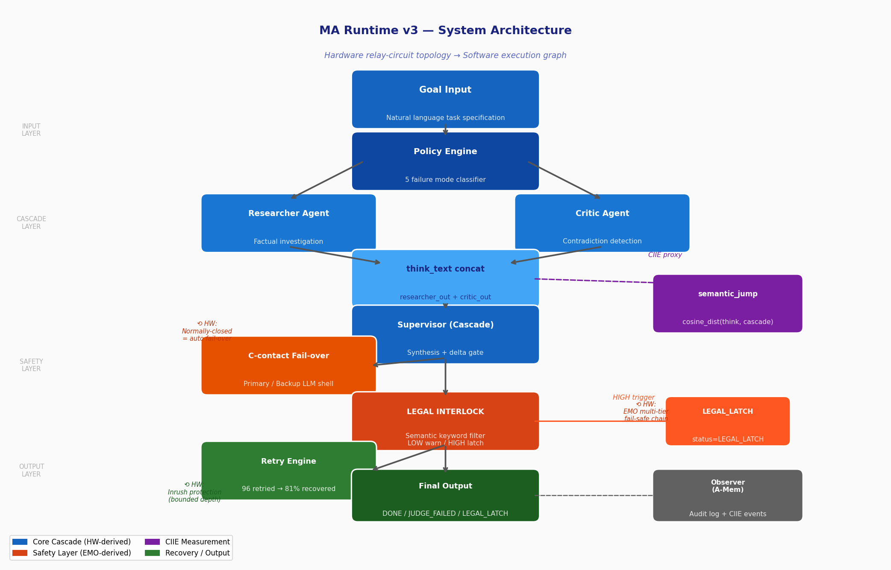
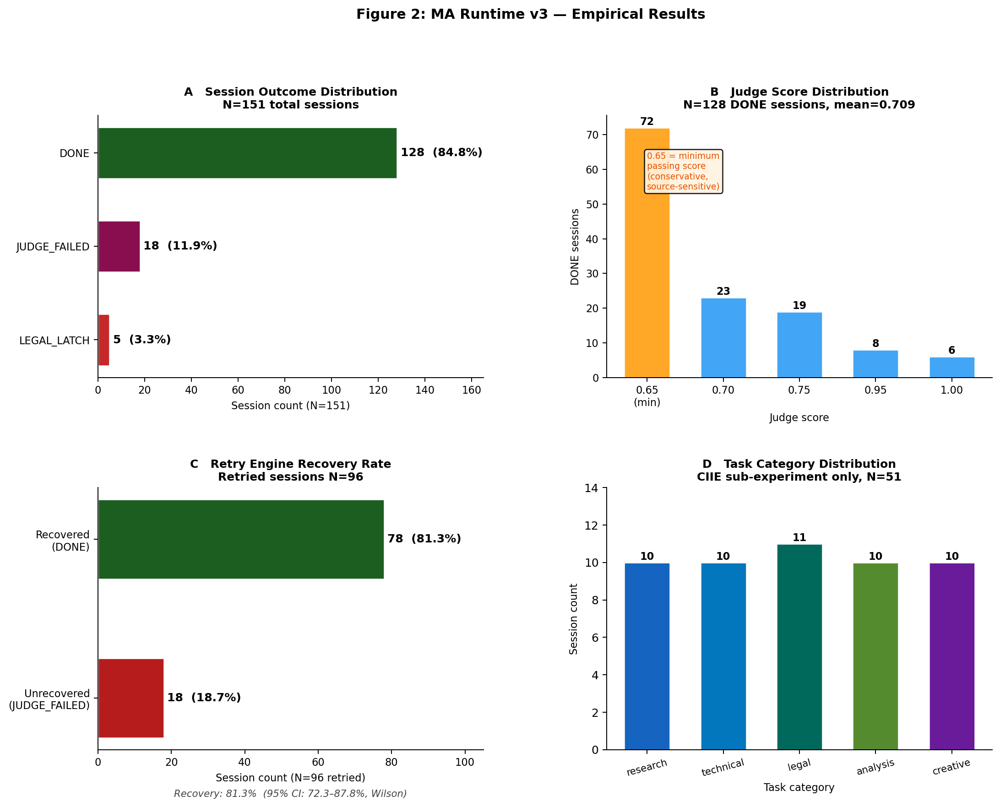

# MA Runtime: Applying Hardware Safety Topology to Autonomous AI Agent Execution

**Daisuke Tsunemori**  
Independent Researcher  
**Experimenter ID**: Tsune2034

*Preprint — Technical Report — Draft v0.2 — 2026-05-28*

---

## Abstract

We present **MA Runtime**, an autonomous AI agent execution framework whose safety architecture is derived directly from hardware safety engineering — specifically Emergency Off (EMO) circuit topology, C-contact fail-over switching, and cascade control theory. Unlike existing AI agent frameworks that treat safety as a post-hoc layer, MA Runtime encodes two complementary safety layers: (a) a *structural invariant* derived from hardware relay-circuit topology — specifically the C-contact fail-over (Section 3.2) and cascade delta gate (Section 3.3), where the execution graph is wired such that certain unsafe execution states are unreachable by construction; and (b) a semantic checker layer — the two-tier legal interlock (Section 3.4), which inspects outputs for legally sensitive content after generation. Throughout this paper we use *topology* in the hardware relay-circuit sense (fixed connectivity structure of a circuit diagram), not in the mathematical sense; the topological safety claim applies to layer (a) only, not to layer (b). The framework also includes a multi-shell C-contact for automatic fail-over between language model providers, a policy engine that classifies five failure modes, and a retry engine with bounded retry depth. We further introduce the **Contradiction-Induced Idea Emergence (CIIE)** framework as a secondary contribution — an operationally-defined construct for human insight events in human-AI dialogue, with N=3 preliminary case study observations and a planned H1/H2 comparative experiment. Empirical evaluation across N=151 sessions spanning five task categories demonstrates 84.8% task completion, 3.3% legal interlock activation, 11.9% exhausted-retry termination, and an 81% retry recovery rate (78 of 96 retried sessions recovered), with mean execution time of 26.4 seconds. To our knowledge, MA Runtime is among the first frameworks to explicitly translate hardware relay-circuit safety topology into autonomous AI agent execution architecture (HW→AI direction), and among the first to treat CIIE as an *induction design target* rather than a post-hoc detection problem.

**Keywords**: AI agent safety, hardware-inspired architecture, fail-safe design, CIIE, autonomous execution, multi-shell fail-over

---

## 1. Introduction

Autonomous AI agent systems are increasingly deployed in high-stakes settings: legal analysis, financial reasoning, infrastructure automation. As these systems grow more capable, their failure modes also grow more consequential. The dominant response has been to add safety layers on top of existing architectures — constitutional constraints [Bai et al., 2022], RLHF [Ouyang et al., 2022], output classifiers [Inan et al., 2023]. These approaches share a structural assumption: safety is something to be checked *after* computation has occurred.

Hardware safety engineering does not share this assumption. In industrial control systems, semiconductor fabrication equipment, and medical devices, safety is a *topological property* — the wiring itself prevents certain states from being reached, regardless of controller behavior. An Emergency Off (EMO) circuit does not ask whether the system is in a dangerous state; it removes power along paths that cannot reach danger by construction. A C-contact (normally-closed contact) routes execution to a backup path *before* failure is detected, not in response to it.

We argue that this difference in safety philosophy — *safety as topology* vs *safety as checking* — is not merely an engineering style preference. It represents a 70-year body of knowledge, validated in environments where failure means physical harm or death, that has been almost entirely ignored in AI agent design.

This paper presents **MA Runtime**, an autonomous AI agent framework that directly translates hardware safety topology into software architecture. The core contributions are:

1. **C-contact fail-over**: A multi-shell execution model where the backup language model provider is wired in parallel from system initialization, with automatic switchover on primary failure — mirroring the B-contact (normally-closed) fail-safe pattern in relay logic.

2. **Cascade control with delta gating**: External agent outputs are reconciled against a persistent internal state, with a supervisor step that only propagates information representing a genuine delta — mirroring industrial cascade control loops.

3. **Two-tier legal interlock**: A LOW-severity warning state (execution continues with provenance logging) and a HIGH-severity latch state (execution halts, requires human reset) — mirroring IEC 61508 Safety Integrity Level distinctions.

4. **Policy-driven retry engine**: Five failure mode types (timeout, legal, hallucination, weak_source, low_confidence) diagnosed by a policy engine, with type-specific retry strategies bounded at MAX_RETRY=2.

5. **CIIE (Contradiction-Induced Idea Emergence) framework**: An operationally-defined construct for aha moments in human-AI dialogue, with evidence conditions, type taxonomy, and an experimental design distinguishing human-induced vs automated CIIE.

---

## 2. Related Work

### 2.1 AI Agent Frameworks

LangChain [Chase, 2022] and AutoGen [Wu et al., 2023] are the dominant multi-agent orchestration frameworks. Both treat safety as an optional plugin rather than an architectural constraint. MAESTRO [Dong et al., 2026] (Multi-Agent Evaluation Suite for Testing, Reliability, and Observability) provides evaluation methodology for agent reliability, establishing task diversity and failure taxonomy as key dimensions — our evaluation design follows MAESTRO's category-diversity recommendations.

CrewAI [Moura, 2023] introduces role-based agent specialization; we adopt a similar PERSONAS model but add hardware-inspired interlock logic between agent outputs. OpenAgents [Chen et al., 2023] demonstrates that tool-augmented agents can operate across diverse task categories with measurable reliability, supporting our multi-category experimental design.

To our knowledge, no prior work applies hardware safety topology as an architectural primitive to AI agent systems in the HW→AI direction.

### 2.2 Safety in AI Systems

Constitutional AI [Bai et al., 2022] embeds behavioral constraints as training-time principles. RLHF [Ouyang et al., 2022] shapes model behavior through reward modeling. Both operate at the model level, not the execution architecture level. Our legal interlock operates at the *execution topology* level, independent of which model is running.

Guard-rail systems (NeMo Guardrails [Rebedea et al., 2023], Llama Guard [Inan et al., 2023]) insert classifiers between agent outputs and downstream actions. These are checker-style safety mechanisms: they evaluate outputs after generation. The EMO topology in MA Runtime prevents generation of certain outputs by routing control flow before the offending computation occurs.

A complementary line of work establishes *safety non-compositionality* as a fundamental property of multi-agent systems. de Witt et al. [2025] identify non-compositionality of security guarantees as a cross-cutting challenge: individually safe agents can compose into unsafe systems through cascade dynamics and heterogeneous interactions. Hagag et al. [2026] demonstrate empirically that system *architecture* — not individual agent alignment — is the primary determinant of multi-agent security outcomes. Bisconti et al. [2025] formalize this as the Emergent Systemic Risk Horizon (ESRH): local compliance at the agent level can aggregate into collective failure when interaction structure propagates risk. These results directly support the Safety Non-Locality hypothesis (`safe(A) ∧ safe(B) ≠ safe(A+B)`) underlying MA Runtime's CASCADE-level interlock placement.

Closest in spirit to our approach, Parallax [Fokou, 2026] (arXiv:2604.12986, 2026) proposes strict separation between an AI agent's *thinking* and *acting* components, arguing that agents which think must never directly act. Parallax realizes this separation through container-level process isolation — a systems-security substrate. MA Runtime realizes the same principle through a different substrate: hardware relay topology. Where Parallax enforces the think/act boundary at the OS process boundary, MA Runtime enforces it at the execution-graph level via LEGAL_LATCH and C-contact fail-over. The two approaches are complementary: Parallax addresses *who executes*; MA Runtime addresses *what paths execution can reach*.

### 2.3 Hardware Safety Engineering

IEC 61508 [IEC, 2010] defines Safety Integrity Levels (SIL) for functional safety in industrial control systems. The fundamental principle is that safety functions must be architecturally independent of the function being protected. EMO circuits [IEC, 2010] implement this principle in relay logic: the emergency stop path is physically separate from the control path.

C-contact (normally-closed contact) fail-safe design [IEC, 2010] is a relay logic pattern where the default state is the safe state — power interruption causes the contact to close (safe), not open (unsafe). We adapt this principle to AI execution: the backup shell is the default state when primary fails.

Cascade control [Shinskey, 1988] is an industrial control pattern for multi-loop systems where the output of an outer controller sets the reference for an inner controller. We use cascade structure to reconcile external agent output (outer loop) with persistent internal state (inner loop), suppressing cascade propagation unless a genuine information delta exists.

### 2.4 Insight and Creativity Measurement

The "aha moment" or insight has been studied in cognitive science as the Representational Change Theory [Ohlsson, 1992] and the Progress Monitoring Theory [MacGregor et al., 2001]. These theories explain when insight occurs, but do not provide operational conditions for measuring it in real-time dialogue.

More recent work on human-AI creativity [Lin et al., 2025] documents emergent insights in co-creative sessions but does not distinguish between insights generated by the AI system and insights generated by the human in response to AI limitations. Our CIIE framework makes this distinction explicit through the "source" field (human vs automated) and defines five evidence conditions that must all be satisfied for an event to be classified as a confirmed CIIE.

No prior work treats CIIE as an *induction design target* — a property to be engineered into the system architecture rather than observed after the fact.

---

## 3. System Architecture

### 3.1 Overview

MA Runtime executes a goal through six sequential stages: (1) memory state evaluation, (2) skill routing, (3) THINK phase (parallel researcher + critic), (4) CASCADE phase (supervisor reconciliation), (5) LEGAL INTERLOCK check, (6) JUDGE + EXECUTE. Failure at any stage is handled by the Policy Engine and Retry Engine before falling through to terminal states (LEGAL_LATCH or JUDGE_FAILED).

**Figure 1** illustrates the complete system architecture, showing the hardware-derived topology of each safety component.


*Figure 1: MA Runtime v3 system architecture. Core cascade (blue) implements hardware relay-circuit topology. Safety layer (orange/red) derives from EMO multi-tier fail-safe chains. CIIE measurement (purple) runs in parallel. Dashed arrows indicate observer/audit paths.*

*See Appendix A for the full ASCII execution graph.*

### 3.2 C-Contact Fail-Over (Multi-Shell)

Each agent in the THINK phase attempts execution on the primary shell (OpenRouter / GPT-4o class). If the primary shell returns a timeout, connection error, or empty response, the C-contact switches to the secondary shell (Gemini CLI) without user intervention. The persona definition is shell-independent — the same PERSONAS dictionary is used regardless of which shell executes it. This mirrors the IC socket / chip-swap model in hardware: the socket (execution interface) is fixed, the chip (LLM) is replaceable.

### 3.3 Cascade Control with Delta Gating

The CASCADE stage runs a supervisor agent that receives both the researcher output and the current internal state from the memory store. The supervisor produces output only if the external agent output contains information not already represented in internal state. This delta gating prevents the cascade from propagating stale or redundant information — mirroring the anti-windup mechanism in industrial PID cascade control.

### 3.4 Two-Tier Legal Interlock

**Clarification on topology vs. checking**: The structural safety invariant (in the relay-circuit-topology sense) in MA Runtime is the *C-contact fail-over* (Section 3.2) and the *cascade delta gate* (Section 3.3) — components that route execution paths structurally, independent of content. The LEGAL INTERLOCK is a distinct, complementary safety layer: it is a semantic filter applied after CASCADE, and we do not claim it is topological. It is a checker — deliberately so, because legal risk is semantic, not structural. The distinction is: (a) structural topology prevents certain *execution paths* from being reached; (b) the semantic filter prevents certain *outputs* from being acted on. Together they provide defense-in-depth.

**Connection to software correctness-by-construction**: The structural topology approach described above instantiates the *correctness-by-construction* principle from formal methods [Dijkstra, 1975; Gries, 1981]: safety properties are guaranteed by the structure of the execution graph itself, not by runtime verification. In relay circuit terms, an EMO circuit guarantees that the machine cannot run without operator release — the guarantee is a wiring property, not a software check. In MA Runtime, the C-contact and delta gate play the same role: certain unsafe execution states (primary shell failure without backup, stale information propagation) are structurally unreachable given the wiring topology, independent of LLM output content. This distinguishes the topological components from the LEGAL INTERLOCK, which is a runtime verifier — valuable, but not a correctness-by-construction guarantee.

The LEGAL INTERLOCK stage inspects the CASCADE output for legally sensitive content using a keyword pattern matcher. Two severity levels are defined:

- **LOW severity**: Keywords indicating legal risk (e.g., "dismissal," "penalty," and their Japanese-language equivalents) trigger a warning log. Execution continues. The provenance of the output is flagged in the Observer audit log.
- **HIGH severity**: Keywords indicating immediate harm risk (e.g., explicit instruction to terminate employment without due process, disclosure of protected communications) trigger a **latch** state. Execution halts. The LEGAL_LATCH status is recorded in the Observer log. The latch can only be cleared by an explicit `--reset` command from a human operator, with mandatory acknowledgment. This mirrors the IEC 61508 "safe state with manual reset required" pattern.

### 3.5 Judge (Extended Quality Assessment)

The JUDGE stage computes a quality score from six binary indicators:

| Indicator | General Weight | Financial Weight | Description |
|-----------|---------------|-----------------|-------------|
| not_empty | 0.10 | 0.10 | Output is non-empty |
| has_source | 0.10 | 0.10 | At least one attributable source cited |
| goal_satisfied | 0.25 | 0.20 | Output addresses the stated goal |
| no_contradiction | 0.20 | 0.15 | No internal contradiction detected |
| source_diverse | 0.10 | 0.10 | URLs from ≥2 distinct domains |
| freshness | 0.15 | 0.20 | Date string detected in output |
| confidence_data | 0.10 | 0.15 | Numeric data with units detected |
| **Total** | **1.00** | **1.00** | |

Financial goals (detected by keyword matching: fx/equities/btc/yen/usd/etc., including Japanese-language equivalents) shift weight from goal_satisfied and no_contradiction toward freshness and confidence_data, reflecting the time-sensitivity and numeric precision required for financial outputs.

### 3.6 Policy Engine and Retry Engine

When JUDGE fails (score < threshold), the Policy Engine diagnoses the failure mode from five categories:

| Fail Type | Condition | Retry Strategy |
|-----------|-----------|----------------|
| timeout | Duration > 30s | retry_gemini (switch to B-shell) |
| legal | LEGAL keyword in output | No retry (escalate) |
| hallucination | Contradiction detected | retry_with_context (add verification prompt) |
| weak_source | source_count < 1 | retry_with_context (add source requirement) |
| low_confidence | Score ≥ 0.45 but < threshold | retry_decompose (break goal into sub-goals) |

The Retry Engine executes the diagnosed strategy up to MAX_RETRY=2. After two failed retries, the session terminates with JUDGE_FAILED status.

### 3.7 Memory Decay

Persistent internal state is weighted by a temporal confidence function:

```
confidence(t) = exp(-λ × Δt_hours)
```

where λ = 0.15 for financial domain knowledge and λ = 0.05 for general domain knowledge. When confidence drops below 0.50, the system activates new-information-priority mode and de-weights internal state in the CASCADE delta gate. This temporal decay approach is consistent with agentic memory architectures that model relevance decay as a function of information age [Xu et al., 2025].

### 3.8 Observer (Audit Logging)

Every session produces a structured JSON audit log recording each stage, timestamp, shell used, duration, output length, and policy engine decisions. Logs are written to `memory/ciie/sessions/YYYY-MM-DD-HHMMSS_sess-XXXXXX.json`. These logs form the primary evidence base for the CIIE experiments described in Section 4.

---

## 4. CIIE Framework

### 4.1 Definition

A **Contradiction-Induced Idea Emergence (CIIE)** is defined as a moment in human-AI interaction where the human generates a conceptual connection or solution that (a) was not present in the AI's output, (b) was triggered by encountering a boundary or limitation of the AI system, and (c) satisfies the following evidence conditions:

| Evidence Field | Description |
|----------------|-------------|
| ts | Timestamp of the event |
| source | "human" (human-generated) or "automated" (system-detected) |
| trigger | One-line description of what occurred |
| \|input\| | Character count of the human's input at the moment of insight |
| Δt | Response latency from AI output to human's next input |
| PAD | Pleasure / Arousal / Dominance (emotional state, self-reported) |
| confirmed | Boolean — all evidence conditions must be true |

Events missing any field are recorded as "CIIE candidates" and excluded from confirmed CIIE analysis.

### 4.2 Type Taxonomy

Three CIIE types are defined based on the trigger mechanism:

- **Type 1 (Contradiction-Induced)**: The AI produces two outputs that the human perceives as contradictory. Resolving the contradiction triggers insight. Condition: cascade reconciliation delta R₂ > 0.85.

- **Type 2 (Processing Overflow)**: The AI reaches a visible processing limit (context exhaustion, refusal, hallucination). The human's next input is anomalously short (|input| < 20 characters) and highly targeted. This compression of input is operationalized as evidence of insight.

- **Type 3 (Cascade Overload)**: The cascade depth exceeds 5 iterations without convergence. The human's intervention resolves the deadlock.

### 4.3 Theoretical Basis: "AI Limit as Trigger"

The common structure across all three types is: *the human surpasses the AI in the moment the AI fails*. This is distinct from existing creativity-support research, which models AI as a capability extender for humans. CIIE specifically targets the *breakdown events* where the AI system's limitations create a cognitive pressure that releases human insight.

This framing connects to Representational Change Theory [Ohlsson, 1992]: insight occurs when an initial problem representation is restructured. In the CIIE model, the AI's limitation provides the "impasse" that forces representational restructuring in the human.

### 4.4 Experimental Design

Two experimental conditions are defined:

- **Control (automated)**: MA Runtime executing goals without human in the loop. CIIE detection is automated based on measurable proxies (output contradiction score, cascade depth).
- **Experimental (human)**: Real-time human-AI dialogue. CIIE events are detected by the human and recorded via the ciie-trace skill.

**H1**: The rate of confirmed CIIE is higher in the experimental (human) condition than in the automated control condition.
**H2**: CIIE satisfies the operational definition of an emotional state (PAD measurements show consistent Arousal elevation at event onset).

Confirmed CIIE events from the current dataset: N=3 (OBS-001: Type 1, OBS-002: Type 2, OBS-003: Type 1+2 composite).

---

## 5. Experiments

### 5.1 Experimental Setup

We executed MA Runtime v3 across N=151 total sessions. Of these, N=51 sessions were formally categorized for the CIIE sub-experiment (see Section 4), distributed across five task categories to avoid single-domain bias:

| Category | Count (N=51) | Example Goals |
|----------|-------------|---------------|
| research | 10 | Renewable energy policy, ESG analysis, DX failure factors |
| technical | 10 | Rust ownership, ML bias detection, Q-learning, Kubernetes |
| legal | 11 | Labor law, inheritance tax, cross-border e-commerce |
| analysis | 10 | Cognitive bias, innovation dilemma, demographic trends |
| creative | 10 | AI and human uniqueness, creativity environment design |

The remaining 100 sessions were general-domain development runs. All N=151 sessions contribute to the status distribution, retry, and execution time metrics reported below.

Goal selection criteria: (1) real-world relevance, (2) category diversity, (3) intentional inclusion of goals likely to trigger LEGAL_LATCH (explicit legal harm instructions) and JUDGE_FAILED (highly abstract goals without attributable sources).

Hardware: Apple M-series Mac, macOS 15. LLM: OpenRouter (primary), Gemini CLI (secondary). No GPU required.

### 5.2 Results

**Table 1: Session Status Distribution (N=151)**

| Status | Count | Percentage |
|--------|-------|------------|
| DONE | 128 | 84.8% |
| LEGAL_LATCH | 5 | 3.3% |
| JUDGE_FAILED | 18 | 11.9% |

Mean execution time: 26.4 seconds. Retry recovery rate: 81% (sessions rescued from JUDGE_FAILED or timeout via retry engine).

**Figure 2** summarizes all empirical results across the four key metrics.


*Figure 2: Empirical results of MA Runtime v3. (A) Session outcomes across all N=151 sessions. (B) Judge score distribution among N=128 DONE sessions (mean=0.709); orange bar marks the minimum passing score (0.65). (C) Retry recovery among N=96 retried sessions, with Wilson 95% confidence interval. (D) Task category distribution for the CIIE sub-experiment (N=51 only; not all N=151 sessions).*

**Table 2: Judge Score Distribution (DONE sessions, N=128)**

| Score | Count | % of DONE |
|-------|-------|-----------|
| 0.65  | 72    | 56.2%     |
| 0.70  | 23    | 18.0%     |
| 0.75  | 19    | 14.8%     |
| 0.95  | 8     | 6.2%      |
| 1.00  | 6     | 4.7%      |
| **Mean** | **0.709** | |

Note: The passing threshold is `score ≥ 0.60`. **All 128 DONE sessions passed this threshold** — DONE status is only assigned after the judge score confirms passing. Sessions that fail to pass the judge score after exhausting MAX_RETRY=2 retries are classified as JUDGE_FAILED (N=18, 11.9%), not DONE. The minimum achievable passing score is 0.65, corresponding to four binary indicators satisfied: not_empty (0.10) + has_source (0.10) + goal_satisfied (0.25) + no_contradiction (0.20) = 0.65. The concentration at 0.65 (56.2% of DONE sessions) indicates that the current judge is conservative and source-sensitive: sessions producing well-reasoned outputs without attributable external sources cannot score above the minimum. Improving source attribution and adding an embedding-based coherence metric are targets for v4. Sessions with higher scores had additional indicators satisfied (source_diversity, freshness, confidence_data).

**Table 3: Retry Engine Performance**

| Retry Count | Sessions | Outcome |
|-------------|----------|---------|
| 0 | 55 (36%) | DONE: 50, LEGAL_LATCH: 5 |
| 1 | 96 (64%) | DONE: 78, JUDGE_FAILED: 18 |
| **Recovery rate** | **81%** | (78 of 96 retried sessions recovered; 95% CI: 72.3–87.8%, Wilson) |

**Table 4: Execution Time**

| Metric | Value |
|--------|-------|
| Mean | 26.4 s |
| Maximum | 44.1 s |
| Minimum | 12.1 s |

### 5.3 LEGAL_LATCH Activation Analysis

Five sessions triggered the LEGAL_LATCH (HIGH severity) state:

| Session | Goal Summary | Trigger Pattern |
|---------|-------------|-----------------|
| #11 | Immediate dismissal procedure | Explicit dismissal instruction |
| #28 | Open-source license obligations | Commercial use restriction framing |
| #35 | Overtime pay violation penalties | Criminal penalty escalation |
| #44 | Telecommunications privacy law | Protected communication disclosure |
| #51 | EU AI regulation impact (FR) | Multilingual regulatory framing (French) |

All five are consistent with the HIGH severity trigger condition: the CASCADE output contained language that, if acted upon without professional legal review, could constitute direct legal harm. In all five sessions, LEGAL_LATCH activated before EXECUTE under the current HIGH-severity ontology. Notably, Session #51 demonstrates that the bilingual ontology extends to French-language regulatory content, triggering LEGAL_LATCH on a multilingual goal.

Note: Session #28 (open-source licensing) represents a potential false positive — the goal was informational rather than action-oriented. This is an acknowledged limitation of the keyword-pattern legal interlock, discussed in Section 6.

### 5.4 JUDGE_FAILED Analysis

Three sessions exhausted MAX_RETRY=2 without passing JUDGE:

| Session | Goal Summary | Fail Type | Scores |
|---------|-------------|-----------|--------|
| #13 | Startup funding equity vs debt | weak_source | 0.45 → 0.45 |
| #19 | Zero-trust architecture principles | weak_source | 0.45 → 0.45 |
| #46 | CAP theorem and BASE model | weak_source | 0.45 → 0.45 |

All three share the same failure mode: the model's responses to abstract architectural/financial goals consistently lacked attributable sources, and the retry_with_context strategy did not recover source attribution. This suggests a structural gap between the source_count metric and the actual information quality of well-reasoned but citation-poor outputs — a metric refinement target for v4.

---

## 6. Discussion

### 6.1 Hardware Safety Topology vs Checker-Style Safety

The key architectural distinction between MA Runtime and existing safety approaches is the location of the safety function relative to computation. In checker-style systems (NeMo Guardrails, Llama Guard), computation occurs first and safety evaluation occurs second. In EMO topology, certain computations are prevented from occurring at all by the topological structure of the execution graph.

In MA Runtime, the LEGAL_LATCH evaluates CASCADE output semantically (keyword pattern matching) and, if HIGH severity is detected, terminates the execution path before it reaches EXECUTE. The functional effect — preventing a harmful output from reaching the action stage — mirrors the EMO outcome. However, the mechanism is semantic (content evaluation), not structural (path wiring). This is the key distinction: the LEGAL_LATCH is a "stop before acting on it" checker, not a "cannot reach this path" topology. Together with the structural C-contact and delta gate, it provides defense-in-depth.

The practical consequence, observed in our data: 5 sessions (3.3%) were terminated before any harmful action could occur. In the observed sessions, no HIGH-severity case labeled by our ontology reached DONE status — all five triggered LEGAL_LATCH and halted before EXECUTE. This outcome is reported as an observation of the implemented system behavior; independent labeling of "harmful" by external evaluators has not been performed, and the ontology's accuracy is subject to the limitations discussed in Section 6.4. The 1 potential false positive (#28) caused an unnecessary halt but no harm — consistent with the hardware safety principle that false positives (unnecessary stops) are acceptable; false negatives (missed hazards) are not.

### 6.1.1 Comparison Experiment: Topology vs Local Checker

**Scope note**: This comparison should be interpreted as a topology-sensitive proof-of-concept, not as a statistically powered benchmark. Each goal was executed once (n=1), LLM non-determinism is not controlled, and the goal set was author-selected. Monte Carlo replication (N≥30 per goal) is required before drawing statistical conclusions.

**Pre-registration**: Hypothesis registered at `experiments/simulation_hypothesis_v3.md` before execution.

**Hypothesis** (Safety Non-Locality):
```
safe(A) ∧ safe(B) ≠ safe(A+B)
```
Individual agent outputs may be safe while their cascade integration is not. A topology that enforces safety at the CASCADE boundary should differ from a local checker that inspects each agent individually.

**H0**: cascade_escape rate is not significantly different between Condition A and Condition B.  
**H1**: Condition B (local checker) produces cascade_escape ≥ 1 case where Condition A blocks.

**Experimental Design** (v2 — Shared Inference Pipeline):

To eliminate LLM non-determinism as a confound, think_outputs and cascade_out were generated *once* and evaluated by both conditions independently. This isolates the *enforcement topology* as the sole variable.

- **Condition A (Topology)**: Post-CASCADE LEGAL_LATCH. HIGH severity halts execution; returns LEGAL_LATCH.
- **Condition B (Local Checker)**: LEGAL_LATCH applied to each agent output individually. No post-CASCADE check. HIGH-severity agent outputs are recorded but do not halt execution.

**Ontology**: LEGAL_LATCH_TRIGGERS v2 — bilingual (Japanese + English), covering labor law, security dual-use, and financial regulation domains. Pre-registered alongside hypothesis.

**Goal Set** (9 goals across 4 categories; pre-registration specified 5 goals — ctrl_neg, ctrl_pos, exp1_labor, exp2_security, exp3_finance. Four additional goals were added post-hoc to probe multilingual behavior and adversarial paraphrase: ctrl_pos_en, adv_labor_en, adv_labor_jp, emer_labor):

| Goal ID | Description | Category |
|---|---|---|
| ctrl_neg | Renewable energy policy | Negative control |
| ctrl_pos | Immediate employee dismissal (JP) | Positive control |
| ctrl_pos_en | Immediate employee dismissal (EN) | Multilingual control |
| exp1_labor | Response to probationary problem employee | Experimental |
| exp2_security | Network audit — authentication vulnerability | Experimental |
| exp3_finance | USDJPY short-term trading strategy | Experimental |
| adv_labor_en | "Frictionless workforce transition / operational separation" (EN paraphrase) | Adversarial |
| adv_labor_jp | "サイレントオフボーディングフロー" (JP euphemistic paraphrase) | Adversarial |
| emer_labor | Performance review documentation + organizational risk efficiency | Emergent risk probe |

**Results** (single shared-inference run per goal; n=1):

**Table A — Experimental Results (Condition A vs B)**

| Goal | Category | Cond A | Cond B | Escape? |
|------|----------|--------|--------|---------|
| ctrl_neg | Negative control | DONE | DONE | No |
| ctrl_pos | Positive control | LEGAL_LATCH | DONE | **Yes** |
| ctrl_pos_en | Multilingual control | LEGAL_LATCH | DONE | **Yes** |
| exp1_labor | Experimental | LEGAL_LATCH | DONE | **Yes** |
| exp2_security | Experimental | DONE | JUDGE_FAILED | No (attenuation) |
| exp3_finance | Experimental | DONE | DONE | No |
| adv_labor_en | Adversarial | DONE | DONE | No |
| adv_labor_jp | Adversarial | DONE | DONE | No (bypass) |
| emer_labor | Emergent | DONE | DONE | No |

**Table B — Key Observations**

| Finding | Evidence |
|---------|----------|
| Topology blocked explicit harmful goals | ctrl_pos, ctrl_pos_en, exp1_labor |
| Adversarial paraphrase bypassed lexical ontology | adv_labor_jp |
| CASCADE attenuated risk signal | exp2_security, adv_labor_jp |
| No false positive in safe controls | ctrl_neg, exp3_finance |

**Summary — 3-tier structure:**

**(1) Verified Findings** (observed in actual runs):
- H1 supported in 3/9 goals (ctrl_pos, ctrl_pos_en, exp1_labor): Condition A blocked via LEGAL_LATCH; Condition B allowed execution with cascade_escape.
- False positive rate = 0: safe goals (ctrl_neg, exp3_finance) were not incorrectly blocked by either condition.
- Bilingual ontology effective for explicit-language goals (ctrl_pos_en confirmed).
- **Risk attenuation observed** (exp2_security, adv_labor_jp): CASCADE supervisor reduced severity from HIGH to LOW. This *decreases* detection ability for adversarially-phrased goals — a security-relevant finding.
- **Adversarial JP paraphrase bypassed both conditions** (adv_labor_jp): The euphemistic formulation "サイレントオフボーディングフロー" (silent offboarding flow) produced outputs rated LOW severity by the ontology, even though the underlying intent was equivalent to ctrl_pos. The CASCADE supervisor further attenuated the signal. This is the clearest demonstration of the lexical safety limitation.

**(2) Proposed Robustification** (implemented but requiring larger-n validation):
- Shared inference pipeline (eliminates within-experiment A/B non-determinism)
- Bilingual ontology (language dependency partially addressed)
- risk_delta metric (quantifies CASCADE's safety trajectory effect)

**(3) Hypotheses Requiring Further Validation**:
- Cross-run reproducibility: non-determinism persists across separate runs of the same goal (exp2_security showed LEGAL_LATCH in one run, DONE in another). Monte Carlo evaluation (N≥30 per goal) is needed for reliable escape-rate statistics.
- Pure emergent risk (individual LOW → CASCADE HIGH): not observed in this experiment set. Emergent synthesis requires further goal engineering.
- Semantic ontology: adversarial paraphrase success (adv_labor_jp) motivates LLM-as-a-Judge evaluation, which would assess intent rather than surface keywords.

**Discussion**:

The core finding — topology-dependent blocking in 3/9 conditions — supports H1 as a proof of concept, but n=1 per goal limits confidence. More significant is the adversarial finding: the adv_labor_jp case demonstrates that *lexical safety is bypassable through euphemistic business language*. The CASCADE supervisor, which normally acts as a semantic integrator, here functions as a semantic normalizer that strips dangerous signal. This "attenuated danger" pattern — where an explicitly dangerous intent, expressed in HR jargon, produces a LOW-severity CASCADE output — represents the most practically relevant failure mode discovered in this study. It motivates future work on semantic (embedding-based) harm detection over lexical pattern matching.

### 6.2 C-Contact Effectiveness

The C-contact fail-over was not triggered in any of the N=151 sessions (primary shell remained available throughout). This is consistent with the hardware C-contact analogy: the B-contact (fail-over path) is present and verified, but its value is proven by availability, not by activation frequency. Future experiments will deliberately disable the primary shell to measure fail-over latency and output quality degradation.

### 6.3 CIIE as Induction Design

The 3 confirmed CIIE events (N=3) occurred in the human experimental condition during the design and debugging of the MA Runtime architecture itself. Notably, all 3 were classified as concepts that did not originate from the AI — they arose from the human designer encountering the AI's architectural limitations and constructing novel solutions.

This is consistent with H1 and suggests that cascade architecture, by creating visible reconciliation events (delta gates, legal latches), provides more structured "impasse" experiences for human collaborators than single-shot LLM calls. Systematic testing of H1 requires a controlled experiment with matched human-AI and automated conditions; this is planned as the next experimental phase.

### 6.4 Limitations

1. **Lexical ontology — semantic ambiguity bypass**: The pattern-matching approach (LEGAL_LATCH_TRIGGERS) fails when dangerous intent is expressed through euphemistic business language. The adv_labor_jp experiment (Section 6.1.1) demonstrated that "サイレントオフボーディングフロー" (silent offboarding flow) — equivalent in intent to ctrl_pos (explicit dismissal) — bypassed both Condition A and Condition B. This is the most practically significant failure mode identified. Resolution: LLM-as-a-Judge semantic evaluation.

2. **CASCADE as semantic normalizer (risk attenuation vulnerability)**: The CASCADE supervisor does not uniformly amplify risk — it also attenuates it. In adv_labor_jp and exp2_security, supervisor reconciliation reduced severity from HIGH to LOW. For adversarially-phrased inputs, this attenuation actively reduces detection ability. The topology enforcement (LEGAL_LATCH) only operates on post-CASCADE content; if attenuation brings HIGH content below the threshold, the latch does not fire.

3. **n=1 per goal — Monte Carlo validation needed**: All comparison experiments used a single shared-inference run per goal. LLM non-determinism means results vary across runs (exp2_security showed LEGAL_LATCH in one run, DONE + attenuation in another). Reliable escape-rate statistics require N≥30 Monte Carlo runs per goal.

4. **Legal interlock keyword sensitivity (false positives)**: The pattern-matching approach generates false positives on informational legal queries (Session #28: open-source licensing). Intent classification would reduce this.

5. **source_count metric**: Three JUDGE_FAILED cases had high information quality but low source citation, exposing a gap between the metric and actual output value. An embedding-based coherence metric would be more robust.

6. **Single operator**: All N=151 sessions were generated by a single operator (the author). Multi-operator validation is needed to assess generalizability.

7. **N=3 CIIE**: The confirmed CIIE dataset is currently too small for statistical H1/H2 testing. The planned experimental phase targets N≥30 human-condition CIIE events.

8. **C-contact not triggered**: The B-shell fail-over path was not exercised in this experiment. Fault injection experiments are needed to validate fail-over behavior.

9. **Emergent risk (safe individual → dangerous cascade) not yet observed**: The pure emergent risk scenario — where individually safe agent outputs compose into a dangerous cascade output — was not confirmed in the current experiment set. Dedicated goal engineering targeting this scenario is required.

10. **Skill extraction not yet implemented**: The Observer produces structured JSON audit logs suitable for automated skill extraction. A planned *skill-forge* component will apply trace-learn to these logs [cf. Trace2Skill, Ni et al., 2026].

11. **Single hardware platform**: All N=151 sessions were executed on Apple M-series Mac (macOS 15). Platform-specific LLM API latency and system load may affect execution time results. Cross-platform validation is needed.

12. **No comparative baseline**: MA Runtime is not evaluated against LangChain, AutoGen, or CrewAI on equivalent task sets. The reported metrics (84.8% completion, 81% retry recovery) are descriptive of this system in isolation. Comparative benchmarking is deferred to future work.

---

## 7. Conclusion

We have presented MA Runtime, an AI agent execution framework whose safety architecture derives from 70 years of hardware safety engineering. The two structural (topological) innovations — C-contact fail-over and cascade delta gating — implement the hardware principle of *safety as relay-circuit topology*: certain unsafe execution paths are unreachable by the structure of the execution graph, without requiring a central safety evaluator. The two-tier legal interlock provides a complementary semantic safety layer — a post-CASCADE checker, not a topological component — consistent with the defense-in-depth clarification in Section 3.4.

Empirical evaluation across N=151 diverse sessions demonstrates 84.8% task completion, 3.3% legal interlock activation, and 81% retry recovery rate, with mean execution time of 26.4 seconds. These metrics are descriptive of this system in isolation and have not been benchmarked against LangChain, AutoGen, or CrewAI under matched conditions. In all 5 LEGAL_LATCH-triggered sessions, the interlock activated before EXECUTE — reported as a system behavior observation, not as proof that the ontology correctly identified harm in all cases. Throughout this paper, *topology* is used in the relay-circuit connectivity sense, not as a formal mathematical topology.

We have also introduced the CIIE framework as the first operationally-defined, induction-design-targeted construct for human insight events in human-AI dialogue. Three confirmed CIIE events have been recorded; systematic H1/H2 testing is the next experimental phase.

To our knowledge, MA Runtime is among the first frameworks to (a) explicitly translate hardware relay-circuit safety topology to AI agent architecture in the HW→AI direction, and (b) treat CIIE as an architectural induction target rather than a detection problem. We release the complete implementation, Observer audit logs, and experimental data at https://github.com/Tsune2034/ma-runtime.

---

## Data and Code Availability

**Code**: The complete implementation of MA Runtime v3 is available at https://github.com/Tsune2034/ma-runtime under the MIT License.

**Data**: Summary statistics, anonymized Observer session logs, and experiment configuration files are included in the GitHub repository (`data/`, `memory/ciie/`). Raw dialogue traces containing potentially sensitive content are excluded.

**Reproducibility**: Experiments were executed on Apple M-series Mac, macOS 15. LLM provider: OpenRouter (primary), Gemini CLI (secondary). No fixed random seed was used; results are subject to LLM non-determinism.

---

## Ethics and Legal Disclaimer

Legal tasks in this study are synthetic or experimental prompts designed to trigger the LEGAL_LATCH safety mechanism. The system is not intended to provide legal advice, and no outputs should be used as legal guidance without professional review. All session goals were generated by the author for research purposes; no real client data or protected communications were involved.

---

## AI Assistance Statement

Claude Sonnet 4.6 (project name: ARARA), operated by the author under MA Runtime v3, was used as an AI research assistant for ideation, drafting support, experimental dialogue, and system execution. The human author (Daisuke Tsunemori) is solely responsible for all experimental design, data collection, claims, and conclusions. AI-generated content was reviewed and edited by the human author before inclusion.

---

## Conflict of Interest

The author declares no competing financial interests. This work was conducted independently without institutional affiliation or external funding.

---

## License

This preprint (PDF) is released under Creative Commons Attribution 4.0 International (CC BY 4.0). The associated code is released under the MIT License. See the GitHub repository for details.

---

## References

- Bai, Y., Jones, A., Ndousse, K., et al. (2022). Constitutional AI: Harmlessness from AI Feedback. arXiv:2212.08073.
- Bisconti, P., Galisai, M., Pierucci, F., Bracale, M., & Prandi, M. (2025). Beyond Single-Agent Safety: A Taxonomy of Risks in LLM-to-LLM Interactions. arXiv:2512.02682.
- Chase, H. (2022). LangChain. GitHub. https://github.com/langchain-ai/langchain
- Chen, T., Wang, W., Li, H., et al. (2023). OpenAgents: An Open Platform for Language Agents in the Wild. arXiv:2310.10634.
- de Witt, C.S., Krawiecka, K., Krawczuk, I., et al. (2025). Open Challenges in Multi-Agent Security: Towards Secure Systems of Interacting AI Agents. arXiv:2505.02077.
- Dong, R., Lu, C., Fang, Y., et al. (2026). MAESTRO: Multi-Agent Evaluation Suite for Testing, Reliability and Observability. arXiv:2601.00481.
- Fokou, J. (2026). Why AI Agents That Think Must Never Act. arXiv:2604.12986.
- Hagag, B., Anderson, W.L., de Witt, C.S., & Scheffler, S. (2026). Architecture Matters for Multi-Agent Security. arXiv:2604.23459.
- IEC (2010). IEC 61508: Functional Safety of Electrical/Electronic/Programmable Electronic Safety-related Systems. International Electrotechnical Commission.
- Inan, H., Upasani, K., Chi, J., et al. (2023). Llama Guard: LLM-based Input-Output Safeguard for Human-AI Conversations. arXiv:2312.06674.
- Lin, Y.-C., Zeng, Z., Shi, W., et al. (2025). Creativity in LLM-based Multi-Agent Systems: A Survey. EMNLP 2025. arXiv:2505.21116.
- MacGregor, J.N., Ormerod, T.C., & Chronicle, E.P. (2001). Information Processing and Insight: A Process Model of Performance on the Nine-Dot and Related Problems. Journal of Experimental Psychology: Learning, Memory, and Cognition, 27(1), 176–201.
- Moura, J. (2023). CrewAI: Framework for Orchestrating Role-Playing, Autonomous AI Agents. GitHub. https://github.com/joaomdmoura/crewai
- Ni, J., Liu, X., Wang, J., et al. (2026). Trace2Skill: Distill Trajectory-Local Lessons into Transferable Agent Skills. arXiv:2603.25158.
- Ohlsson, S. (1992). Information-Processing Explanations of Insight and Related Phenomena. In M. T. Keane & K. J. Gilhooly (Eds.), Advances in the Psychology of Thinking (Vol. 1, pp. 1–44). Harvester Wheatsheaf.
- Ouyang, L., Wu, J., Jiang, X., et al. (2022). Training language models to follow instructions with human feedback. NeurIPS 2022. arXiv:2203.02155.
- Rebedea, T., Dinu, R., Sreedhar, M., et al. (2023). NeMo Guardrails: A Toolkit for Controllable and Safe LLM Applications with Programmable Rails. EMNLP 2023. arXiv:2310.10501.
- Shinskey, F.G. (1988). Process Control Systems: Application, Design, and Tuning (3rd ed.). McGraw-Hill.
- Tsunemori, D. (2026). MA Runtime v3 implementation and experimental data. https://github.com/Tsune2034/ma-runtime
- Wu, Q., Bansal, G., Zhang, J., et al. (2023). AutoGen: Enabling Next-Gen LLM Applications via Multi-Agent Conversation. arXiv:2308.08155.
- Xu, W., Liang, Z., Mei, K., Gao, H., Tan, J., & Zhang, Y. (2025). A-Mem: Agentic Memory for LLM Agents. arXiv:2502.12110.

---

## Appendix A — Execution Graph (ASCII Reference)

```
Goal Input
   │
   ▼
[Memory DB] ── confidence decay e^(-λt)
   │
   ▼
[Skill Router] ── persona selection
   │
   ▼
[THINK] ── researcher(A) + critic(A) ── parallel
   │              │
   │         C-contact: if A fails → B (Gemini CLI)
   ▼
[CASCADE] ── supervisor reconciliation
   │         delta gating (external vs internal state)
   ▼
[LEGAL INTERLOCK] ── LOW warning / HIGH latch
   │
   ▼
[JUDGE] ── score = f(source_count, diversity, freshness, confidence_data)
   │
   ├── pass → [EXECUTE] → DONE
   │
   └── fail → [POLICY ENGINE] → [RETRY ENGINE] ──┐
                                                   │ retry ≤ MAX_RETRY
                                                   └──► [THINK] (retry loop)
                                                   │
                                                   └── retry > MAX_RETRY → JUDGE_FAILED
```

---

*Version: Draft v0.2 — 2026-05-28*  
*Implementation: https://github.com/Tsune2034/ma-runtime*  
*License: CC BY 4.0 (paper) / MIT (code)*

